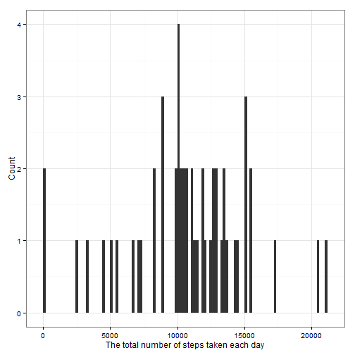
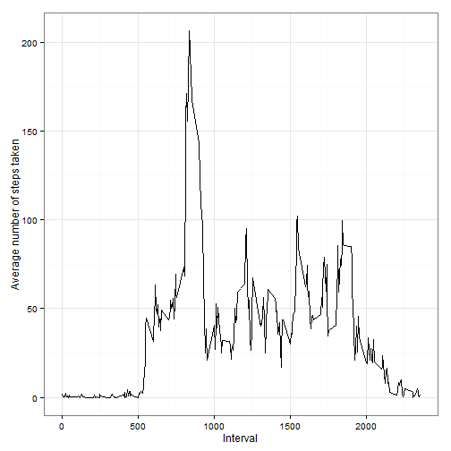
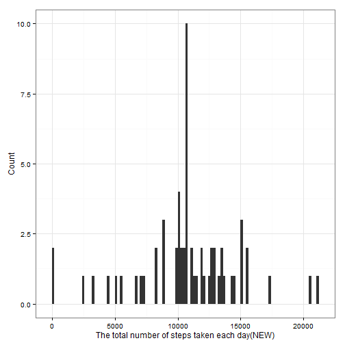
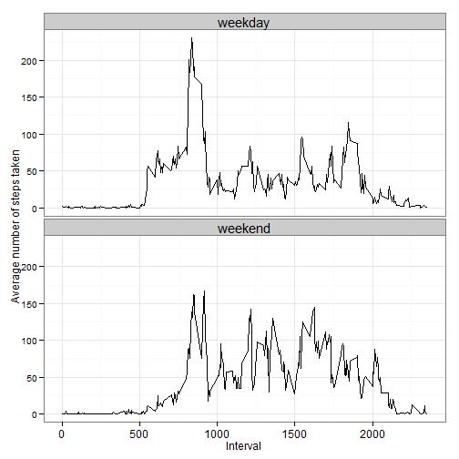

# Reproducible Research: Peer Assessment 1


## 1. Loading and preprocessing the data

```r
if(!file.exists("./reproducible")){ dir.create("./reproducible")}
fileUrl <- "https://d396qusza40orc.cloudfront.net/repdata%2Fdata%2Factivity.zip"
download.file(fileUrl, "./reproducible/activity.zip")
unzip("./reproducible/activity.zip", exdir="./reproducible")
dataset <- read.csv("./reproducible/activity.csv")
fileDir <- "C:/Users/Hongcheol/Desktop/Coursera/reproducible/RepData_PeerAssessment1"
setwd(fileDir)

library(knitr)
library(markdown)
library(plyr)
library(ggplot2)
library(scales)
```


## 2. What is mean total number of steps taken per day?

### 2.1 Make a histogram of the total number of steps taken each day

```r
daytotalsteps <- ddply(dataset, .(date), summarize, totalSteps = sum(steps, na.rm=T))
```
Among the total number of steps taken each day, we have some zero values. So, here I want to interpret these values, and will decide whether I am going to include them or not.


```r
zerototalsteps <- daytotalsteps[daytotalsteps$totalSteps==0,]
zerototalsteps
```

```
##          date totalSteps
## 1  2012-10-01          0
## 8  2012-10-08          0
## 32 2012-11-01          0
## 35 2012-11-04          0
## 40 2012-11-09          0
## 41 2012-11-10          0
## 45 2012-11-14          0
## 61 2012-11-30          0
```

```r
summary(is.na(dataset[dataset$date=="2012-10-01",]))
```

```
##   steps            date          interval      
##  Mode:logical   Mode :logical   Mode :logical  
##  TRUE:288       FALSE:288       FALSE:288      
##  NA's:0         NA's :0         NA's :0
```
Here I made a summary for one of the zero values to check how many of original values are missing values and how many of them are real zero values. According to the result(all 288 values of 'steps' are missing values), we can say that all of step values are missed, which means it doesn't make sense to include them as a zero value. Simply because missing value doesn't mean zero value. That's why I will drop all zero values here with the following command.


```r
daytotalsteps <- daytotalsteps[daytotalsteps$totalSteps != 0,]
```

if you want to check for other zero values other than the one that I did above("2012-10-01"), here is the code you can implement with.

for(i in zerototalsteps$date){
        cat(i, " : ", summary(is.na(dataset[dataset$date==i,])),"\n")
}


```r
tot1 <- ggplot(daytotalsteps, aes(x=totalSteps)) + geom_histogram(binwidth=200)
tot1 <- tot1 + theme_bw()
tot1 <- tot1 + labs(x = "The total number of steps taken each day", y = "Count")
print(tot1)
```

 


### 2.2 Calculate and report the mean and median total number of steps taken per day

```r
mean(daytotalsteps$totalSteps)
```

```
## [1] 10766
```

```r
median(daytotalsteps$totalSteps)
```

```
## [1] 10765
```


## 3. What is the average daily activity pattern?

### 3.1 Make a time series plot (i.e. type = "l") of the 5-minute interval (x-axis) and the average number of steps taken, averaged across all days (y-axis)

```r
dataset <- read.csv("./reproducible/activity.csv")
intervalAverage <- ddply(dataset, .(interval), summarize, averageSteps = mean(steps, na.rm=T))
```


Simliar to the total number of steps taken each day above, here we have also some zero values. Let's go underneath the data, and see how they look like. 

```r
zeroAverageSteps <- intervalAverage[intervalAverage$averageSteps==0,]
zeroAverageSteps
```

```
##     interval averageSteps
## 9         40            0
## 17       120            0
## 24       155            0
## 25       200            0
## 26       205            0
## 28       215            0
## 29       220            0
## 31       230            0
## 33       240            0
## 34       245            0
## 37       300            0
## 38       305            0
## 39       310            0
## 40       315            0
## 47       350            0
## 48       355            0
## 52       415            0
## 61       500            0
## 279     2310            0
```

```r
summary(is.na(dataset[dataset$interval==40,]))
```

```
##    steps            date          interval      
##  Mode :logical   Mode :logical   Mode :logical  
##  FALSE:53        FALSE:61        FALSE:61       
##  TRUE :8         NA's :0         NA's :0        
##  NA's :0
```

Here I also make a summary for one of the zero values. However, here we see totally different data construction. As you can see here we have only 8 missing values among 61 values, and it takes only 13% of the total values, and the portion of missing value of other intervals is same. What that means is we can use these zero values as real zero values. Here it doesn't make sense to drop these zero values because of small portion of missing values. That's why I won't drop any value from them.

For those who wants to implement other zero values, here is the code again.

for(i in zeroAverageSteps$interval){
        cat(i, " : ", summary(is.na(dataset[dataset$interval==i,])),"\n")
}


```r
Aev <- ggplot(intervalAverage, aes(x=interval, y=averageSteps)) 
Aev <- Aev + geom_line(lty=1)
Aev <- Aev + theme_bw()
Aev <- Aev + labs(x = "Interval", y = "Average number of steps taken")
print(Aev)
```

 


### 3.2 Which 5-minute interval, on average across all the days in the dataset, contains the maximum number of steps?

```r
intervalAverage[with(intervalAverage, averageSteps==max(averageSteps)),]
```

```
##     interval averageSteps
## 104      835        206.2
```


## 4. Imputing missing values

### 4.1 Calculate and report the total number of missing values in the dataset (i.e. the total number of rows with NAs)

```r
dataset <- read.csv("./reproducible/activity.csv")
missingData <- dataset[is.na(dataset$steps),]
nrow(missingData)
```

```
## [1] 2304
```


### 4.2 Devise a strategy for filling in all of the missing values in the dataset. The strategy does not need to be sophisticated. For example, you could use the mean/median for that day, or the mean for that 5-minute interval, etc.
I will put the mean for that 5-minute interval into the corresponding missing values as a strategy for filling in all of the missing values in the dataset.


### 4.3 Create a new dataset that is equal to the original dataset but with the missing data filled in.

```r
missingData <- dataset[is.na(dataset$steps),]
intervalAverage <- ddply(dataset, .(interval), summarize, averageSteps = mean(steps, na.rm=T))
head(missingData);head(intervalAverage)
```

```
##   steps       date interval
## 1    NA 2012-10-01        0
## 2    NA 2012-10-01        5
## 3    NA 2012-10-01       10
## 4    NA 2012-10-01       15
## 5    NA 2012-10-01       20
## 6    NA 2012-10-01       25
```

```
##   interval averageSteps
## 1        0      1.71698
## 2        5      0.33962
## 3       10      0.13208
## 4       15      0.15094
## 5       20      0.07547
## 6       25      2.09434
```

merge them together by 'interval', and copy the 'averageSteps' values to the missing 'steps' values to fill the missing values.

```r
mergedData <- merge(missingData, intervalAverage, by="interval")
mergedData$steps <- mergedData$averageSteps 
mergedData$averageSteps <- NULL
```

To combine with the original 'dataset' change the order of columns and rows of 'mergedData', and put it back to the 'dataset'

```r
mergedData <- subset(mergedData, select=c(steps, date, interval))
mergedData <- mergedData[with(mergedData, order(date, interval)),]
dataset[is.na(dataset$steps),] <- mergedData
datasetNEW <- dataset
```

Now you see there is no missing values anymore in the new dataset('datasetNEW').

```r
summary(is.na(datasetNEW))
```

```
##    steps            date          interval      
##  Mode :logical   Mode :logical   Mode :logical  
##  FALSE:17568     FALSE:17568     FALSE:17568    
##  NA's :0         NA's :0         NA's :0
```


### 4.4 Make a histogram of the total number of steps taken each day 

```r
daytotalstepsNEW <- ddply(datasetNEW, .(date), summarize, totalStepsNEW = sum(steps, na.rm=T))
tot2 <- ggplot(daytotalstepsNEW, aes(x=totalStepsNEW)) + geom_histogram(binwidth=200)
tot2 <- tot2 + theme_bw()
tot2 <- tot2 + labs(x = "The total number of steps taken each day(NEW)", y = "Count")
print(tot2)
```

 


### 4.5 Calculate and report the mean and median total number of steps taken per day. 

```r
mean(daytotalstepsNEW$totalStepsNEW)
```

```
## [1] 10766
```

```r
median(daytotalstepsNEW$totalStepsNEW)
```

```
## [1] 10766
```
mean and median values for new dataset are almost same as the original data. 


### 4.6 Do these values differ from the estimates from the first part of the assignment? What is the impact of imputing missing data on the estimates of the total daily number of steps?

```r
summary(daytotalsteps$totalSteps)
```

```
##    Min. 1st Qu.  Median    Mean 3rd Qu.    Max. 
##      41    8840   10800   10800   13300   21200
```

```r
summary(daytotalstepsNEW$totalStepsNEW)
```

```
##    Min. 1st Qu.  Median    Mean 3rd Qu.    Max. 
##      41    9820   10800   10800   12800   21200
```

```r
sd(daytotalsteps$totalSteps)
```

```
## [1] 4269
```

```r
sd(daytotalstepsNEW$totalStepsNEW)
```

```
## [1] 3974
```
As we impute missing data, quantile of the data were changed, especially 1st and 3rd quantile were pushed into the centric direction. In other words, standard deviation of the data was decreased.


## 5. Are there differences in activity patterns between weekdays and weekends?

### 5.1 Create a new factor variable in the dataset with two levels 'weekday' and 'weekend' indicating whether a given date is a weekday or weekend day.

```r
Sys.setlocale("LC_TIME", "English")
```

```
## [1] "English_United States.1252"
```

```r
datasetNEW$date <- as.Date(as.character(datasetNEW$date), "%Y-%m-%d")
datasetNEW$weekdays <- weekdays(datasetNEW$date)
for(i in 1:nrow(datasetNEW)){
        if(datasetNEW$weekdays[i] =="Saturday"|datasetNEW$weekdays[i]=="Sunday"){
        datasetNEW$weekdayend[i] <- "weekend"
        } else { datasetNEW$weekdayend[i] <- "weekday"}
}
datasetNEW$weekdayend <- as.factor(datasetNEW$weekdayend)
```

### 5.2 Make a panel plot containing a time series plot (i.e. type = "l") of the 5-minute interval (x-axis) and the average number of steps taken, averaged across all weekday days or weekend days (y-axis).


```r
intervalAverageNEW <- ddply(datasetNEW, .(weekdayend, interval), summarize, averageStepsNEW = mean(steps, na.rm=T))

AevNEW <- ggplot(intervalAverageNEW, aes(x=interval, y=averageStepsNEW))
AevNEW <- AevNEW + geom_line(lty=1)
AevNEW <- AevNEW + facet_wrap(~ weekdayend, nrow=2)
AevNEW <- AevNEW + theme_bw()
AevNEW <- AevNEW + labs(x = "Interval", y = "Average number of steps taken")
AevNEW <- AevNEW + theme(strip.text.x = element_text(size=15)) 
AevNEW <- AevNEW + theme(axis.text.x= element_text(size=12))
print(AevNEW)
```

 
